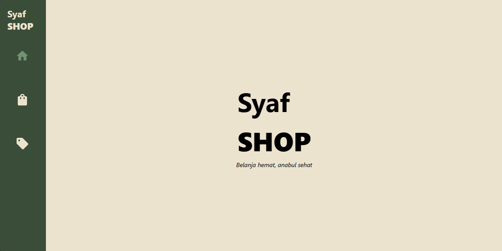
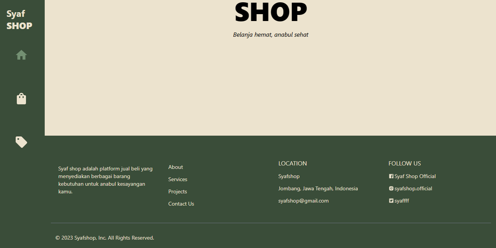
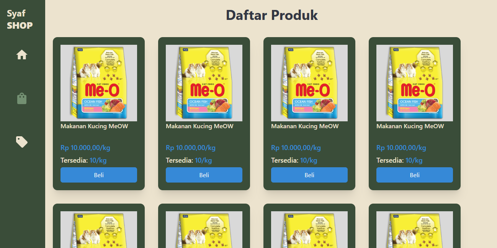
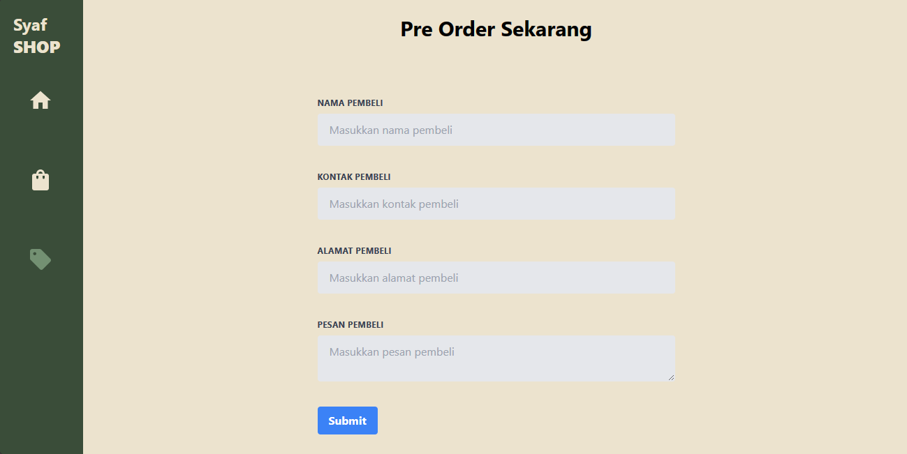

# UTS Pemrograman WEB Lanjut 2023

This application was built with [React](https://react.dev/) with template by [Vite](https://vitejs.dev/) and styling using [Tailwindcss](https://tailwindcss.com/) to make interactive view.

## How To Run

> [!IMPORTANT]
> Before you can run this app, make sure that you have installed `Node.js` and `Git` on your computer (Please note, Git and Github are not same!).
> To be able to use the features provided, please install the backend for this application [UTS_PWL_BACKEND](https://github.com/syafirawulandari/UTS_PWL_BACKEND.git)

#### Clone this repositories

Clone this repository on your computer through your computer's terminal by running the following command:

```
git clone https://github.com/syafirawulandari/UTS_PWL_FRONTEND.git
```

Wait until the clone process is complete to proceed with the directory change step through your computer’s terminal.

#### Change To App Directory

The next step is to change directories. If you are using Windows, you can use the following command:

```
cd UTS_PWL_FRONTEND
```

#### Depedencies Installation

Before you can run this app, you are required to install the necessary dependencies. Use the following command:

```
npm install
```

The dependency installation process will take about 5-10 minutes (depending on your internet speed). If the dependency installation fails and an error message appears, try to make sure that you have installed [Node.js](https://nodejs.org/en).

#### Start For Run The App

This app runs in development mode, you can run this app using the following command:

```
npm run dev
```

This App run at [http://localhost:5173](http://localhost:5173).

## Preview



####



####



####



## Author

Syafira Wulandari | 120140142
[syafirawulandari](https://github.com/syafirawulandari)
